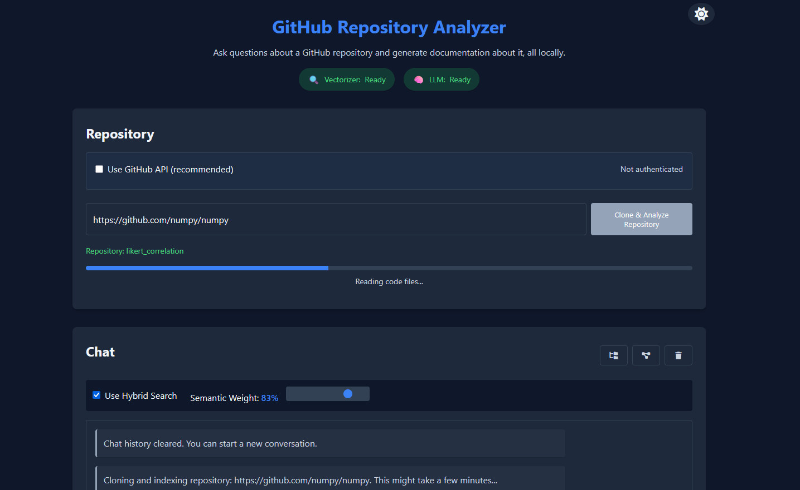
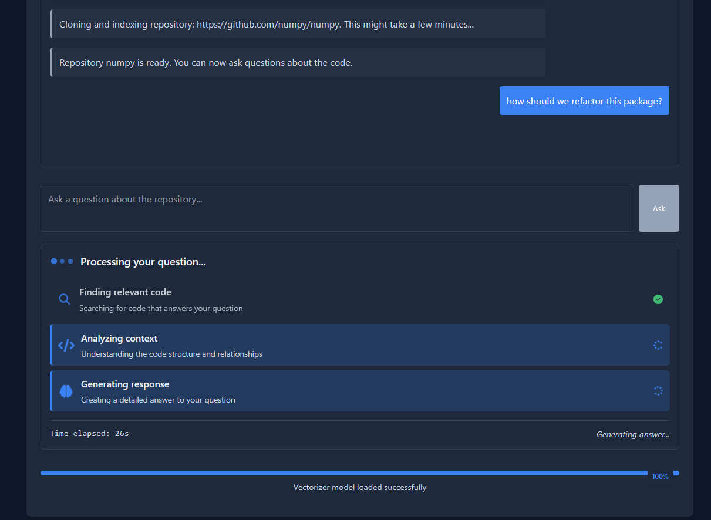
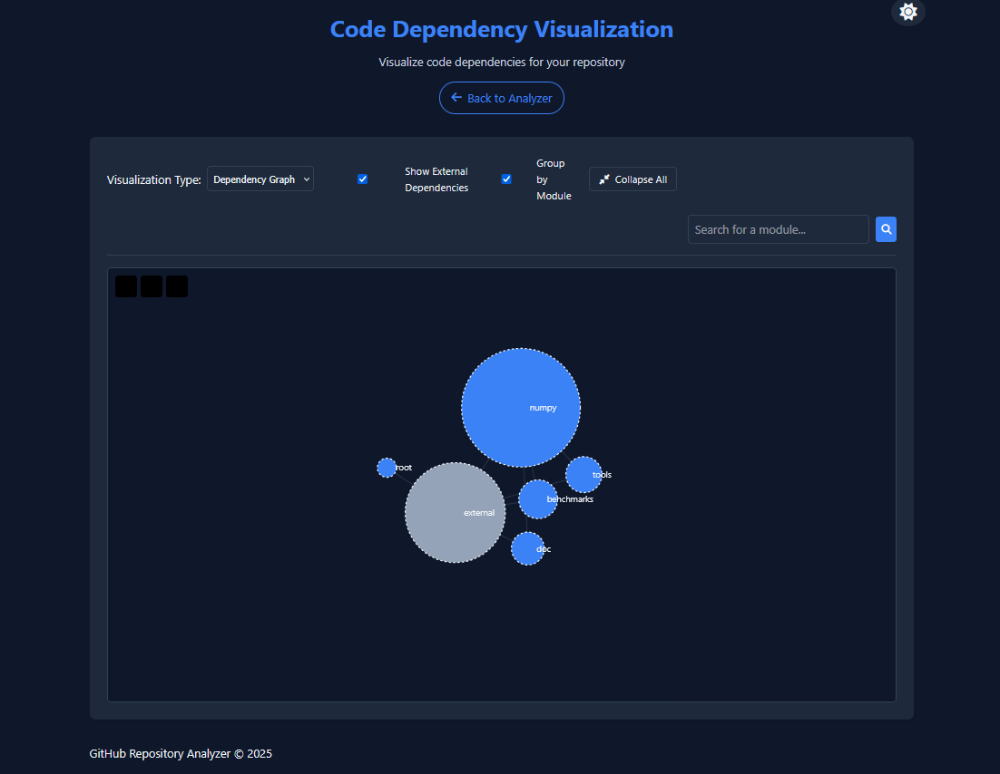

# GitHub Repository Analyzer

A powerful tool for analyzing GitHub repositories using FAISS, RAG (Retrieval-Augmented Generation), and advanced code analysis techniques. Ask questions about your codebase and get intelligent responses with context-aware understanding.

## Features

### Core Functionality
- **Clone any GitHub repository** - Public or private with token authentication
- **Index code files** using advanced semantic and hybrid search techniques
- **Ask questions about the codebase** with a chat-like interface
- **Uses Retrieval-Augmented Generation (RAG)** for accurate answers
- **Leverages LLama.cpp** for efficient LLM inference
- **Desktop Application** - Runs as a native desktop window, not just a website
- **GPU Acceleration** - Automatically uses GPU for faster processing when available

### Advanced Features
- **Repository Visualization** - View code dependencies and structure as interactive graphs
- **Incremental Indexing** - Only reindex files that have changed for better performance
- **Hybrid Search** - Combines semantic search with keyword search for better results
- **Test/Documentation Generation** - Automatically generate tests and documentation
- **Code Structure Analysis** - Analyze function relationships, class hierarchies, and dependencies
- **Persistent Sessions** - Save chat history between sessions
- **Dark Mode Support** - Toggle between light and dark themes

## Screenshots





## Installation

### Prerequisites

- Python 3.12+
- Poetry (dependency management)

### Setup

1. Clone this repository:
```bash
git clone https://github.com/yourusername/github-repo-analyzer.git
cd github-repo-analyzer
```

2. Install dependencies using Poetry:
```bash
poetry install
```

### Running the Application

Run the desktop application:
```bash
poetry run python src/app_launcher.py
```

This will launch the application in its own desktop window using pywebview, not just a website in a browser.

## GPU Acceleration

The application automatically detects if you have a compatible NVIDIA GPU with CUDA support and uses it for faster processing.

### Enabling GPU Support Manually

If you want to explicitly install GPU support:

```bash
# Run the GPU setup utility
poetry run python src/utils/gpu_setup.py
```

This utility will:
1. Check if you have a compatible GPU
2. Guide you through installing GPU-accelerated dependencies
3. Configure the system for best performance

## Advanced Features Usage

### Repository Visualization

1. After cloning and indexing a repository, click the "Code Structure" button
2. Choose between different visualization types:
   - Dependency Graph: Shows module relationships
   - Module Tree: Displays hierarchical structure
   - File Size Treemap: Visualizes relative file sizes

### Test/Documentation Generation

1. Navigate to a file in the Code Structure panel
2. Click on a file to see options for generating:
   - Unit tests
   - Documentation
   - Code explanations

### GitHub Integration

1. Check "Use GitHub API" in the repository section
2. Enter a personal access token to access private repositories
3. The token will be securely stored in your browser's local storage

## TODO: Building and Installation

This section will outline the implementation of a cross-platform installation process:

- **Installer Creation**: Develop a build script that packages the application for different platforms (Windows, macOS, Linux)
- **GPU Detection**: Implement automatic detection of CUDA-compatible GPUs during installation
- **Dependency Management**: Bundle appropriate dependencies based on detected hardware
- **User Interface**: Create a user-friendly installation wizard with:
  - Custom installation location selection
  - Desktop/Start Menu shortcut options
  - Automatic environment configuration
- **Cross-Platform Support**: Ensure consistent installation experience across operating systems
- **Post-Installation**: Configure application for first run with optimal settings

## How It Works

### Repository Indexing
1. Code files are parsed into chunks
2. Each chunk is converted to a vector embedding using the Sentence Transformers model
3. Embeddings are indexed using FAISS for efficient similarity search
4. File hashes are stored to enable incremental indexing

### Question Answering
1. Query is processed through both semantic and keyword indexing (hybrid search)
2. Most relevant code chunks are retrieved
3. LLM generates an answer based on the retrieved context

### Code Visualization
1. File dependencies are analyzed and stored
2. D3.js visualizations render the code structure and relationships
3. Interactive elements allow exploration and filtering

### Desktop Integration
1. Flask server runs in the background
2. PyWebView creates a native desktop window
3. The window displays the Flask web application without browser controls
4. Application data is stored in platform-appropriate locations

## Configuration

You can modify the configuration in `src/config.py` to:
- Change the embedding model
- Use a different LLM
- Adjust FAISS parameters
- Change data storage locations

## License

[MIT License](LICENSE)